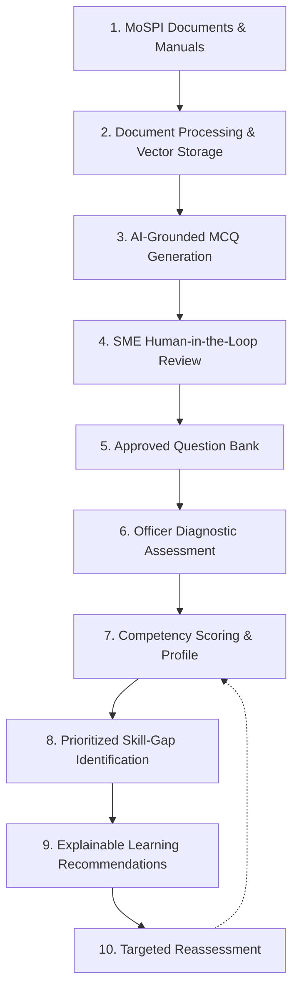
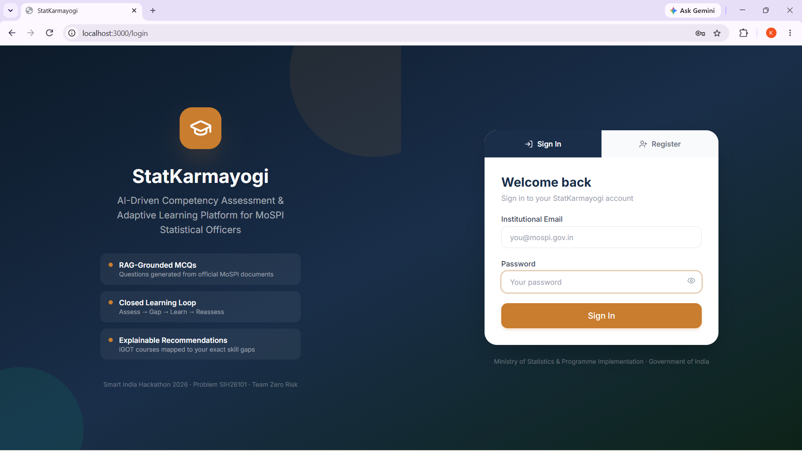
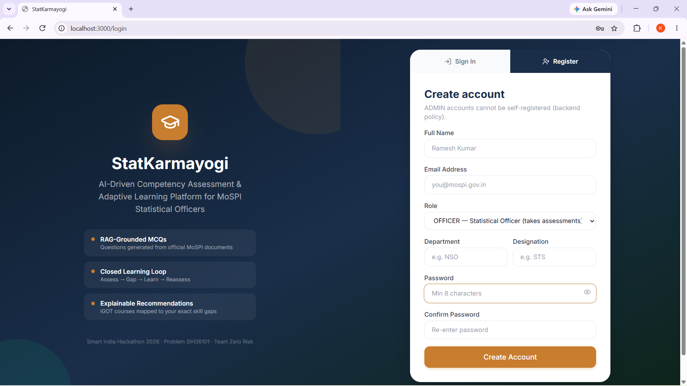
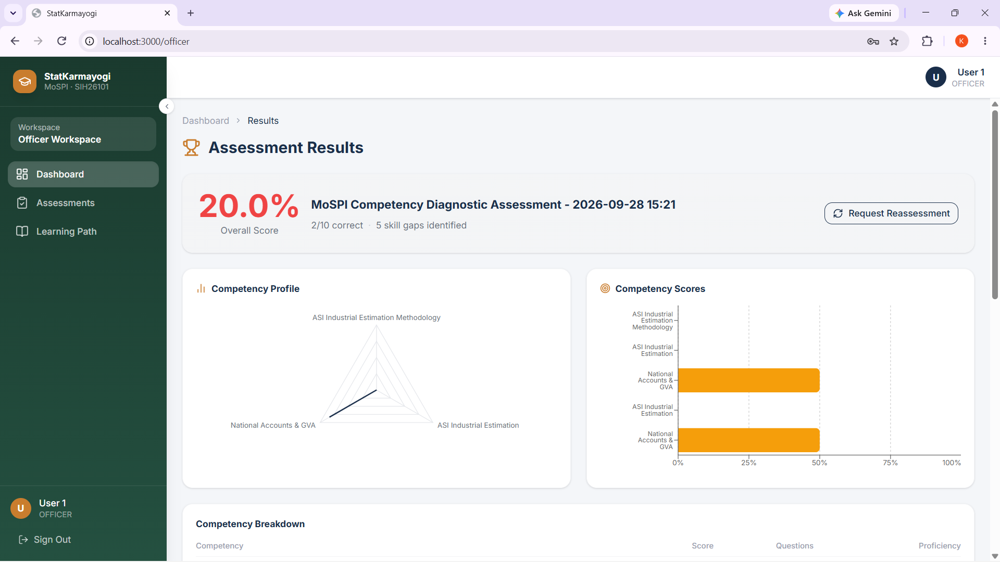

# StatKarmayogi

StatKarmayogi is an AI-driven competency assessment and adaptive learning platform designed specifically around the operational needs of statistical officers in the Ministry of Statistics and Programme Implementation (MoSPI). Developed as an engineering prototype for the Smart India Hackathon 2026, the platform bridges the divide between official statistical manuals, diagnostic skill evaluations, and targeted capacity building.

The system is architected around a continuous closed learning loop:

$$\text{\bf Assess} \longrightarrow \text{\bf Identify Competency Gaps} \longrightarrow \text{\bf Learn} \longrightarrow \text{\bf Reassess}$$

The prototype demonstrates:
- **AI-grounded MCQ generation** from official reference manuals
- **Human-in-the-loop SME validation** before questions enter any assessment pool
- **Competency-based diagnostic assessments** with difficulty and domain tagging
- **Automated skill-gap identification** prioritized by proficiency thresholds
- **Explainable learning recommendations** with clear relevance and match scores

---

## Problem We Address

In national statistical operations and public administration, personnel training faces several structural challenges:

- **Generic Training Modules:** Training is often scheduled uniformly across cadres without pre-assessing individual officer strengths and weaknesses.
- **Lack of Measurable Competency Tracking:** Departments lack granular, quantifiable visibility into specific domain proficiencies (e.g., National Accounts, Index Numbers, Survey Methodologies).
- **Disconnected Learning Resources:** Officers rarely receive learning recommendations directly tied to their demonstrated skill deficits.
- **Risk of Unverified AI Content:** Generating assessment material with generative AI carries hallucination risks unless subject-matter experts validate every question before deployment.

---

## Our Solution

StatKarmayogi implements a structured, 10-step end-to-end workflow combining AI efficiency with strict human oversight:

1. **Document Ingestion:** A Trainer uploads official MoSPI reference manuals, guidelines, or presentations.
2. **Text Processing & Chunking:** Documents are parsed, split into contextual chunks, and indexed into a local vector store.
3. **AI-Grounded MCQ Generation:** An LLM generates candidate multiple-choice questions grounded directly in document chunks.
4. **SME Review & Curation:** Subject-Matter Experts (SMEs) inspect candidate questions, edit if necessary, and approve or reject them.
5. **Approved Question Bank:** Only SME-approved questions enter the active diagnostic assessment repository.
6. **Diagnostic Assessment:** Officers take competency-based assessments with difficulty and domain tags.
7. **Automated Scoring:** Assessment responses are evaluated deterministically to calculate competency-specific scores.
8. **Skill-Gap Identification:** Competencies falling below benchmark thresholds are categorized into prioritized skill gaps.
9. **Explainable Recommendations:** The platform recommends relevant learning modules, explaining why each course was suggested.
10. **Targeted Reassessment:** Officers can reassess after learning to verify skill gap closure and measure score improvement.

---

## Key Features

- **Role-Based Authentication & Workspaces:** Secure authentication with distinct portals for Trainers, SMEs, Officers, and Admins.
- **Trainer Document Ingestion:** Direct upload and automated parsing of MoSPI manuals, handbooks, and presentations (PDF/PPTX).
- **RAG-Grounded Question Generation:** Context-aware MCQ creation grounded in reference document chunks using Mistral AI.
- **Human-in-the-Loop SME Review:** Dedicated interface for experts to inspect, accept, or reject generated questions.
- **Isolated Question Pools:** Strict separation between candidate questions (`PENDING_REVIEW`) and validated assessment pools (`APPROVED`).
- **Competency Diagnostic Assessments:** Timed or untimed assessments with question selection by volume and source document.
- **Granular Competency Tagging:** Questions tagged with MoSPI statistical competencies and difficulty levels (Easy, Medium, Hard).
- **Multi-Dimensional Profiling:** Performance visualization using radar charts for competency footprints and bar charts for category scores.
- **Automated Gap Prioritization:** Algorithmic classification of skill deficits into High, Medium, and Low priority gaps.
- **Explainable Recommendation Engine:** Transparent course matching detailing assessment score, priority level, and domain match percentage.
- **Closed-Loop Reassessment:** Support for subsequent assessments to evaluate competency gains and learning impact.
- **Robust Persistence Layer:** Full relational schema in PostgreSQL (16 tables) and ChromaDB vector persistence.

---

# Prototype Walkthrough

The following walkthrough illustrates the end-to-end user journey across all roles in the current prototype.

### 1. Role-Based Login

*StatKarmayogi Authentication Portal*

The platform provides a dedicated authentication entry point and routes authorized users into their respective role-based workspaces.

### 2. Role-Based Account Configuration

*Role-Based User Configuration*

Users can be configured with their name, institutional email, role, department, designation, and credentials, allowing the platform to provide role-specific capabilities.

### 3. Trainer Document & MCQ Generation Console

*Trainer Console & Document Management*

Trainers can upload MoSPI/reference documents and generate AI-grounded MCQs based on processed source content.

### 4. Human-in-the-Loop SME Review

*SME Review Queue for Candidate Questions*

AI-generated questions enter an SME review queue where subject-matter experts can inspect generated questions before they enter the assessment pool.

### 5. Validated Question Pool

*SME Approved Question Bank*

SMEs can approve questions after review, separating validated questions from pending and rejected content before questions are used for officer assessments.

### 6. Officer Assessment Workspace

*Officer Assessment Workspace*

Officers can initiate a diagnostic assessment, choose the number of questions, and optionally filter questions by source document.

### 7. Competency Diagnostic Assessment

*Live Competency Assessment Interface*

Officers answer competency-tagged questions with difficulty indicators while the system tracks progress and responses.

### 8. Competency Profile & Assessment Results

*Competency Profile & Performance Breakdown*

The completed assessment is converted into an overall score and competency-level performance profile, allowing the platform to identify areas requiring improvement.

### 9. Skill-Gap Diagnosis & Learning Recommendations

*Skill-Gap Diagnosis & Explainable Learning Pathway*

The platform identifies competency gaps and classifies their priority. It then maps those gaps to relevant learning recommendations and provides an explanation of the recommendation, including information such as competency relevance, assessment performance, priority, and match score where available.

---

## AI + Human Validation

Quality and accuracy are paramount when assessing government statistical officers. StatKarmayogi enforces a strict governance pipeline:

$$\text{\bf Document} \longrightarrow \text{\bf AI / RAG} \longrightarrow \text{\bf Generated MCQ} \longrightarrow \text{\bf SME Review} \longrightarrow \text{\bf Approved Question Bank} \longrightarrow \text{\bf Assessment}$$

AI models (Mistral Large & Mistral Embed) accelerate content authoring by extracting factual questions directly from reference manuals. However, **no AI-generated question is ever presented to an officer without human approval**. The SME review stage provides essential oversight, allowing experts to verify question phrasing, validate answer correctness, adjust difficulty levels, and ensure proper competency alignment.

---

## Competency & Adaptive Learning Loop

StatKarmayogi moves beyond static testing by establishing a continuous improvement cycle:

$$\text{\bf Assessment} \longrightarrow \text{\bf Competency Scores} \longrightarrow \text{\bf Skill Gaps} \longrightarrow \text{\bf Learning Recommendation} \longrightarrow \text{\bf Learning} \longrightarrow \text{\bf Reassessment}$$

Rather than issuing a simple pass/fail grade, the assessment evaluates evidence across each MoSPI competency domain. When an officer exhibits deficits below the target proficiency threshold (80%), the system isolates the specific competency gap, assigns a priority rating, and points the officer toward targeted training. Once training is completed, reassessment measures actual knowledge gain, closing the learning loop.

---

## iGOT Course Integration — Current Status

A central vision of the platform is aligning MoSPI officer upskilling directly with the Government of India’s **iGOT Karmayogi** capacity-building ecosystem.

> [!IMPORTANT]
> **Integration Boundary Clarification:**
> - The current prototype demonstrates the **learning recommendation workflow and user interface** for connecting identified competency gaps with learning resources.
> - We currently **do NOT have access to official iGOT course or catalog APIs** required for live integration.
> - Therefore, the prototype **does NOT claim a live official iGOT API connection**.
> - The recommendation layer has been architected so that official course catalog data and enrollment endpoints can be plugged in once API credentials and access are granted by the competent authority.

The intended production integration pathway is designed as follows:

$$\text{\bf Identified Skill Gap} \longrightarrow \text{\bf Competency Mapping} \longrightarrow \text{\bf Official iGOT Course API} \longrightarrow \text{\bf Relevant Course} \longrightarrow \text{\bf Officer Learning Path}$$

The existing interface demonstrates how recommended courses appear to officers, complete with calculated match scores, domain relevance percentages, and human-readable explanations derived from assessment evidence.

---

## End-to-End Workflow

| Stage | Actor | System Action | Output |
|:---:|:---:|:---|:---|
| **1** | **Trainer** | Uploads source document (PDF/PPTX) | Processed document & indexed chunks |
| **2** | **AI System** | Generates grounded MCQs via RAG pipeline | Candidate questions (`PENDING_REVIEW`) |
| **3** | **SME** | Reviews, edits, and evaluates candidate questions | Approved or rejected questions |
| **4** | **Officer** | Takes diagnostic competency assessment | Submitted assessment responses |
| **5** | **Assessment Engine** | Evaluates answers against validated keys | Overall score & competency profile |
| **6** | **Gap Engine** | Evaluates competency scores against thresholds | Prioritized skill gaps (High/Med/Low) |
| **7** | **Recommendation Engine** | Computes match scores and maps gaps to courses | Explainable learning recommendations |
| **8** | **Officer** | Engages with recommended training content | Tracked learning progress |
| **9** | **Officer** | Requests and completes targeted reassessment | Updated competency profile & delta |

---

## Technology & Architecture

The prototype is built using a modern, scalable, and decoupled software stack:

- **Frontend:**
  - **Framework:** React 19 with Vite
  - **Styling & UI:** Tailwind CSS v4, Framer Motion, Lucide React
  - **Data Visualization:** Recharts (Radar chart for competency footprints, horizontal bar charts for category performance)
  - **Routing & State:** React Router DOM, React Context API (`AuthContext`)

- **Backend:**
  - **Framework:** FastAPI (Python 3) with asynchronous Uvicorn server
  - **Validation & Schemas:** Pydantic v2
  - **Security & Auth:** Argon2id password hashing, JWT bearer tokens, Role-Based Access Control (RBAC)

- **Database & Storage:**
  - **Relational Database:** PostgreSQL managed via SQLAlchemy 2.0 ORM and Alembic migrations (16 structured tables)
  - **Vector Database:** ChromaDB for local embedding storage and chunk retrieval
  - **File Storage:** Local document storage for ingested PDF and PPTX reference files

- **AI & Document Processing:**
  - **Language Model:** Mistral Large (`mistral-large-latest`) for context-grounded MCQ generation
  - **Embeddings:** Mistral Embed (`mistral-embed`) for chunk vector representations
  - **Document Parsers:** `pypdf` for PDF parsing, `python-pptx` for presentation decks
  - **Chunking Pipeline:** LangChain `RecursiveCharacterTextSplitter` (chunk size: 1000, overlap: 150)

---

## Current Prototype Status

| Demonstrated in the Prototype | External Integration / Future Scope |
|:---|:---|
| Full role-based authentication (Admin, Trainer, SME, Officer) | Live official iGOT Karmayogi API integration (pending credentials) |
| Reference document upload, parsing, and chunking pipeline | Single Sign-On (SSO) integration with Parichay / Jan Parichay |
| RAG-grounded candidate MCQ generation with Mistral AI | Dynamic Item Response Theory (IRT) adaptive testing |
| SME review workflow (approve, reject, edit) | Cadre-wide administrative analytics for MoSPI leadership |
| Competency diagnostic assessment with masked answer keys | Multi-language assessment generation (Hindi & regional languages) |
| Multi-dimensional competency scoring (Radar & Bar visualizers) | Enterprise multi-node deployment across field offices |
| Automated skill gap identification (High / Medium / Low) | Automated course syllabus crawler and catalog synchronizer |
| Explainable learning recommendations with domain match scores | Direct LMS SCORM/xAPI completion tracking |
| Reassessment mechanism to measure competency progress | |

---

## Future Scope

1. **Official iGOT Karmayogi API Integration:** Connect live course catalogs, progress tracking, and certificate synchronization once official API endpoints and credentials are provided.
2. **Expanded MoSPI Competency Mapping:** Extend question banks and competency trees across specialized statistical wings, including National Accounts (NAD), Field Operations (FOD), and Economic Statistics (ESD).
3. **Adaptive Item Sequencing:** Implement Item Response Theory (IRT) algorithms to adjust question difficulty dynamically based on real-time officer responses.
4. **Cadre Analytics for Leadership:** Provide MoSPI administrators with aggregate analytics on divisional strengths, training needs, and regional capacity trends.
5. **Multi-Modal & Multi-Lingual Expansion:** Support bilingual assessments (Hindi and English) and tabular data ingestion from statistical surveys.

---

## Smart India Hackathon

**Smart India Hackathon 2026**  
**Problem Statement:** SIH26101  
**Team:** Zero Risk  
**Project:** StatKarmayogi
