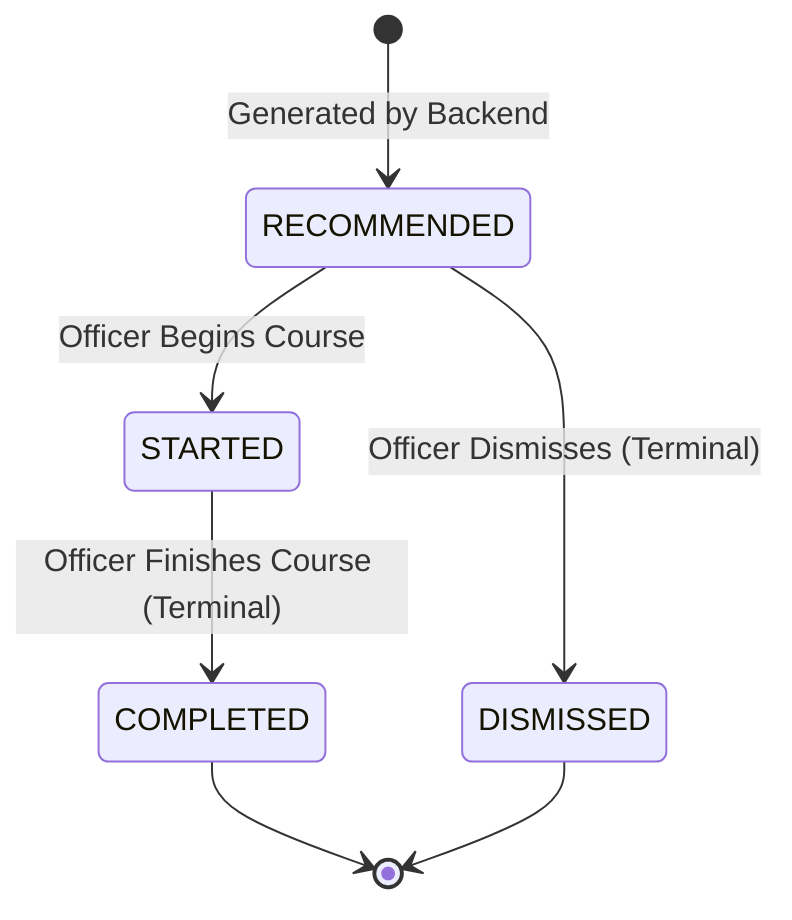

# Implementation Plan: Phase 8 — iGOT Learning Pathways & Course Recommendations

**StatKarmayogi — AI-Driven Competency Assessment & Adaptive iGOT Learning Pathway for MoSPI (SIH26101)**

---

## 1. Goal & Architectural Role in the Closed Learning Loop

Implement **Phase 8: iGOT Learning Pathways & Course Recommendations** for the StatKarmayogi backend.

Phase 8 completes the transition from diagnostic competency assessment into the adaptive learning phase of the closed learning loop:

$$\text{Assess (Phase 7)} \longrightarrow \text{Skill Gaps (Phase 7)} \longrightarrow \mathbf{iGOT\ Recommendations\ (Phase\ 8)} \longrightarrow \text{Learn} \longrightarrow \text{Reassess (Phase 9)}$$

The primary objectives are:
1. Connect Phase 7 persisted `skill_gaps` records directly to an iGOT-aligned prototype course catalogue.
2. Execute a 100% deterministic, zero-AI matching algorithm directly against PostgreSQL `Course` and `CourseCompetency` records to calculate match scores and gap priorities.
3. Establish that **the iGOT adapter is an integration boundary, not a mandatory dependency in the core deterministic scoring algorithm**.
4. Generate transparent, template-based, explainable recommendation reasons citing the exact diagnostic basis.
5. Provide safe recommendation regeneration that strictly preserves officer learning history (`STARTED`, `COMPLETED`, and `DISMISSED` states), applying `MAX_TOTAL_ACTIVE_RECOMMENDATIONS = 6` solely to the current active recommendation set.
6. Enforce a strict recommendation status state machine.
7. Maintain safe transaction boundaries such that:
   > **Assessment submission MUST retain the existing Phase 7 HTTP response status and response contract. Recommendation-generation failure MUST NOT invalidate or roll back an already-completed assessment.**
8. Ensure Phase 8 authorization directly reuses and extends the project's existing RBAC mechanisms without introducing any parallel authorization system.
9. Ensure every URL stored or returned by Phase 8 either points to an actually implemented route or is `null`/omitted when no valid external route exists. There will be **zero dead course URLs**.

---

## 2. Existing Architecture & Codebase Inspection Findings

The existing codebase was thoroughly inspected and verified at the model and schema level:
- **`skill_gaps` Model** ([`app/models/skill_gap.py`](file:///c:/SIH/backend/app/models/skill_gap.py)):
  - Foreign keys: `assessment_id` (CASCADE), `competency_id` (RESTRICT).
  - Columns: `id`, `assessment_id`, `competency_id`, `score_percentage` (Numeric 5,2), `gap_level` (`HIGH`, `MEDIUM`, `LOW`), `created_at`.
- **`courses` Model** ([`app/models/course.py`](file:///c:/SIH/backend/app/models/course.py)):
  - Columns: `id`, `igot_course_id` (String 100, unique, nullable), `title` (String 255), `description` (Text), `provider` (String 255), `language` (String 50), `difficulty` (String 50), `duration_minutes` (Integer), `course_url` (String 500), `is_public` (Boolean), `is_active` (Boolean), `source` (String 100, default "iGOT Karmayogi"), `created_at`, `updated_at`.
  - Notice: **`is_external` is NOT present in the database table or model.**
- **`course_competencies` Model** ([`app/models/course_competency.py`](file:///c:/SIH/backend/app/models/course_competency.py)):
  - Foreign keys: `course_id` (CASCADE), `competency_id` (RESTRICT).
  - Columns: `id`, `course_id`, `competency_id`, `relevance_score` (Numeric 3,2, default 1.00), `created_at`.
  - Constraint: `UniqueConstraint("course_id", "competency_id", name="uq_course_competency")`.
- **`recommendations` Model** ([`app/models/recommendation.py`](file:///c:/SIH/backend/app/models/recommendation.py)):
  - Foreign keys: `officer_id` (RESTRICT), `assessment_id` (CASCADE), `competency_id` (RESTRICT), `course_id` (RESTRICT).
  - Columns: `id`, `officer_id`, `assessment_id`, `competency_id`, `course_id`, `priority` (Integer, default 1), `match_score` (Numeric 5,2), `reason` (Text), `status` (`RecommendationStatus`), `created_at`.
- **`RecommendationStatus` Enum** ([`app/models/enums.py`](file:///c:/SIH/backend/app/models/enums.py)):
  - Enum values: `RECOMMENDED`, `STARTED`, `COMPLETED`, `DISMISSED`.
- **Assessment Submission Flow & Response Contract** ([`app/services/assessment_service.py`](file:///c:/SIH/backend/app/services/assessment_service.py)):
  - `submit_assessment` completes evaluation atomically, commits `answers`, `competency_results`, `skill_gaps`, and marks `assessment.status = COMPLETED`, returning the established `AssessmentResultResponse`.
- **RBAC & Security Utilities** ([`app/core/dependencies.py`](file:///c:/SIH/backend/app/core/dependencies.py)):
  - Standard `get_current_user` and `require_roles(...)` dependencies enforcing `RoleName` values (`OFFICER`, `TRAINER`, `ADMIN`, `SME`).

> [!IMPORTANT]
> **VERIFICATION BOUNDARY**:
> Architecture and database constraints have been verified at the model/schema level. Runtime data verification remains required before seed execution, specifically for existing competency records and course-to-competency mappings.

---

## 3. Database Schema Constraints (Zero Migrations, Exactly 16 Tables)

> [!IMPORTANT]
> **EXACTLY 16 PostgreSQL TABLES — ZERO MIGRATIONS — ZERO SCHEMA ALTERATIONS**:
> The 16 tables in `statkarmayogi_db` already contain `courses`, `course_competencies`, and `recommendations`.
> - Zero tables will be added.
> - Zero columns will be added or modified.
> - Zero enums will be modified.
> - Zero Alembic migrations or DDL statements will be executed.
> - **`is_external` MUST NOT be introduced** into SQLAlchemy models, schemas, or database tables.
> - All planned attributes map directly to pre-existing fields verified above.

---

## 4. Course Catalogue Strategy & Prototype Authenticity

Prototype courses are explicitly defined as:
**"iGOT-aligned prototype course catalogue based on reference/public learning content"**

Rules:
1. **No False Claims**: All sample records indicate `source = "iGOT-Aligned Prototype"`. No claim of verified live external iGOT sync is made.
2. **No Fabricated Government URLs**: No fictional domains like `https://mock.igotkarmayogi.gov.in/...`.
3. **No Nonexistent Mock Endpoints**: The plan strictly avoids fictional preview routes such as `/api/v1/mock/igot/courses/{igot_course_id}/preview`.
4. **Valid Route or Null Policy**:
   Every URL stored or returned by Phase 8 either:
   - points to an **actually implemented route** (e.g. the backend course-detail route `/api/v1/courses/{course_id}`), OR
   - is set to **`null`** when no external URL exists, allowing the frontend to navigate via the course ID / detail endpoint.
   **There will be NO dead course URLs.**
5. **No `is_external` Field**: Distinguishing prototype courses from external live courses is handled via the existing `source` column (e.g. `source = "iGOT-Aligned Prototype"`). Zero schema modifications.

---

## 5. Mock iGOT Adapter Architecture & Role Separation

The final architecture explicitly distinguishes between:

### A. Local Prototype Recommendation Engine
Authoritative local catalogue queried directly for deterministic recommendation generation:
```text
SkillGap
   ↓
CourseCompetency
   ↓
Course
   ↓
Deterministic Matching Algorithm
   ↓
Recommendation
```
- The existing PostgreSQL `Course` and `CourseCompetency` records are the authoritative local recommendation catalogue.
- Deterministic recommendation matching directly queries these database tables using standard SQLAlchemy sessions.
- `MockIGOTAdapter` MUST NOT be artificially inserted into the core deterministic recommendation matching calculation if it provides no functional value.

### B. iGOT Integration Abstraction
The adapter exists to abstract external course catalogue access and provide a clean future migration path to real iGOT integration:
```text
BaseIGOTAdapter (Abstract Interface)
   ├── MockIGOTAdapter (Phase 8 Prototype Integration)
   └── ProductionIGOTAdapter (Future Production Integration)
```

> [!NOTE]
> **"The IGOT adapter is an integration boundary, not a mandatory dependency in the core deterministic scoring algorithm."**

Adapter Usage Rules:
- **Where Used**: The adapter is located in `app/integrations/igot_adapter.py`. It provides an isolated integration boundary for course catalogue discovery, external metadata retrieval, or future synchronization jobs.
- **Where NOT Used**: It is NOT invoked during diagnostic assessment evaluation or deterministic score calculations.
- **Constraints**: No real external iGOT API calls are required; no fabricated external iGOT endpoints may be configured; no real enrollment functionality is required.

---

## 6. Configuration & Constants (`app/core/config.py`)

Update [`app/core/config.py`](file:///c:/SIH/backend/app/core/config.py) with the single authoritative Phase 8 recommendation limits:
```python
# Phase 8: iGOT Recommendation & Adapter Configuration
MAX_RECOMMENDATIONS_PER_GAP: int = 2
MAX_TOTAL_ACTIVE_RECOMMENDATIONS: int = 6  # Single authoritative cap for current active recommendations
IGOT_ADAPTER_TYPE: str = "mock"            # "mock" or "production"
MOCK_IGOT_CATALOGUE_VERSION: str = "v1-prototype"
```

> [!NOTE]
> `MAX_TOTAL_ACTIVE_RECOMMENDATIONS` is the single authoritative configuration parameter used throughout configuration, services, reconciliation logic, tests, and acceptance criteria. Competing variable names like `MAX_TOTAL_RECOMMENDATIONS` are removed.

---

## 7. Prototype Seed Strategy & Runtime Competency Catalogue Verification

> [!IMPORTANT]
> **Course-to-competency mappings will be verified against the existing competency catalogue before seed execution. No competency IDs will be assumed or fabricated.**

### Pre-Seed Competency Catalogue Verification Protocol:
Before implementing course seed mappings, the implementation MUST inspect the actual database records:
1. Inspect the existing `competencies` model.
2. Inspect the actual existing competency records in PostgreSQL.
3. Identify the actual competency IDs/codes available.
4. Verify which existing competencies correspond to the intended course mappings.
5. Use those verified existing competency IDs/codes in `CourseCompetency`.
6. Do NOT invent competency IDs.
7. Do NOT assume sequential IDs.
8. Do NOT create duplicate competencies.
9. Do NOT modify the competency schema.
10. Do NOT create a database migration.

If a proposed course-to-competency mapping does not correspond to an existing competency:
- Document the mismatch;
- Adapt the mapping to an existing appropriate competency if the catalogue supports it;
- Otherwise flag that specific mapping as requiring human confirmation before seed execution.

### Prototype Course Set:
Implement [`app/db/seed_courses.py`](file:///c:/SIH/backend/app/db/seed_courses.py) with an idempotent `seed_courses(db)` function:
- Checks if courses already exist (`igot_course_id` lookups).
- Seeds 6 prototype courses mapped to verified MoSPI statistical competencies:
  1. `IGOT-PROTO-ASI-01`: *Annual Survey of Industries (ASI): Frame, Concepts & Sampling* (Duration: 180 min, Difficulty: Intermediate, Source: "iGOT-Aligned Prototype", `course_url`: None)
  2. `IGOT-PROTO-IIP-01`: *Compilation of Index of Industrial Production (IIP) & Laspeyres Weighting* (Duration: 120 min, Difficulty: Beginner, Source: "iGOT-Aligned Prototype", `course_url`: None)
  3. `IGOT-PROTO-NAS-01`: *National Accounts Statistics: Gross Value Added (GVA) & Fixed Capital* (Duration: 240 min, Difficulty: Hard, Source: "iGOT-Aligned Prototype", `course_url`: None)
  4. `IGOT-PROTO-SSD-01`: *Sample Survey Design & Multi-Stage Sampling in Official Statistics* (Duration: 150 min, Difficulty: Intermediate, Source: "iGOT-Aligned Prototype", `course_url`: None)
  5. `IGOT-PROTO-FPOS-01`: *Fundamental Principles of Official Statistics & Data Ethics* (Duration: 90 min, Difficulty: Beginner, Source: "iGOT-Aligned Prototype", `course_url`: None)
  6. `IGOT-PROTO-DAP-01`: *Data Analytics & Statistical Analysis for Field Officers* (Duration: 210 min, Difficulty: Intermediate, Source: "iGOT-Aligned Prototype", `course_url`: None)
- **Curated Prototype Relevance Scores**:
  Seeds `CourseCompetency` records linking each course to standard competencies with **curated prototype relevance scores** (e.g. `0.95`, `0.90`, `0.85`).
  > [!NOTE]
  > These scores are explicitly documented as **curated prototype relevance scores / calibration weights** for demonstration and testing, not official ratings assigned by MoSPI or iGOT Karmayogi.
- Seed operation is idempotent and safe to run repeatedly without creating duplicate records.

---

## 8. Pydantic Request & Response Schemas

### A. Course Schemas (`app/schemas/course.py`)
- `CourseCompetencyResponse`:
  - `competency_id`: int
  - `competency_code`: str
  - `competency_name`: str
  - `relevance_score`: float
- `CourseResponse`:
  - Base course attributes: `id`, `igot_course_id`, `title`, `description`, `provider`, `language`, `difficulty`, `duration_minutes`, `course_url` (Optional[str]), `is_public`, `source`, `created_at`
  - *(Zero `is_external` field)*
- `CourseDetailResponse`:
  - Extends `CourseResponse` with `competencies: List[CourseCompetencyResponse]`
- `CourseListResponse`:
  - `total`: int
  - `items`: `List[CourseResponse]`

### B. Recommendation Schemas (`app/schemas/recommendation.py`)
- `RecommendationStatusUpdateRequest`:
  - `status`: `RecommendationStatus` (`STARTED`, `COMPLETED`, or `DISMISSED`)
- `RecommendationResponse`:
  - `id`: int
  - `officer_id`: int
  - `assessment_id`: int
  - `competency_id`: int
  - `competency_code`: Optional[str]
  - `competency_name`: Optional[str]
  - `course_id`: int
  - `course_title`: str
  - `course_url`: Optional[str]
  - `course_provider`: Optional[str]
  - `course_duration_minutes`: Optional[int]
  - `course_difficulty`: Optional[str]
  - `priority`: int (1 = High, 2 = Medium, 3 = Low)
  - `match_score`: float
  - `reason`: str
  - `status`: `RecommendationStatus`
  - `created_at`: datetime
- `RecommendationListResponse`:
  - `total`: int
  - `items`: `List[RecommendationResponse]`
- `LearningPathwayResponse`:
  - `assessment_id`: int
  - `officer_id`: int
  - `total_recommendations`: int
  - `high_priority_count`: int
  - `recommendations`: `List[RecommendationResponse]`

---

## 9. Recommendation Service Architecture & Interface

Create [`app/services/recommendation_service.py`](file:///c:/SIH/backend/app/services/recommendation_service.py):
- `generate_recommendations(db: Session, assessment_id: int, current_user: User) -> List[RecommendationResponse]`:
  - Validates assessment exists and `status == AssessmentStatus.COMPLETED`.
  - Enforces RBAC: Officer must own the assessment; Admin can generate for any assessment; Trainers cannot trigger generation (`403`).
  - Queries `skill_gaps` for `assessment_id`. If empty, returns an empty list `[]` without error.
  - Executes deterministic matching directly against PostgreSQL records (`SkillGap` $\rightarrow$ `CourseCompetency` $\rightarrow$ `Course`).
  - Limits the current active recommendation set to `MAX_TOTAL_ACTIVE_RECOMMENDATIONS = 6`.
  - Performs safe idempotency reconciliation preserving all historical records (`STARTED`, `COMPLETED`, `DISMISSED`).
  - Commits changes using standard SQLAlchemy session conventions (`db.commit()`).
- `list_assessment_recommendations(db: Session, assessment_id: int, current_user: User) -> List[RecommendationResponse]`:
  - Enforces ownership: Officer can view only their own; Trainer and Admin can view across all officers; SME receives `403`.
- `list_recommendations(db: Session, current_user: User, assessment_id: Optional[int], status_filter: Optional[RecommendationStatus], skip: int, limit: int) -> RecommendationListResponse`:
  - Officer sees only their own recommendations.
  - Trainer and Admin can query across all officers.
  - SME receives `403 Forbidden`.
- `get_recommendation(db: Session, recommendation_id: int, current_user: User) -> RecommendationResponse`:
  - Officer can view only their own; Trainer and Admin can inspect; SME receives `403`.
- `update_recommendation_status(db: Session, recommendation_id: int, request: RecommendationStatusUpdateRequest, current_user: User) -> RecommendationResponse`:
  - Enforces ownership: Only the assigned Officer or Admin can update status; Trainer and SME receive `403`.
  - Validates transitions via status state machine.
  - Updates `status` and commits.

---

## 10. Deterministic Matching & Scoring Algorithm

Matching is 100% deterministic with zero AI/LLM dependency:

1. **Gap Multipliers & Priority Assignment**:
   - `GapLevel.HIGH` $\implies \text{gap\_multiplier} = 1.00$, $\text{priority} = 1$
   - `GapLevel.MEDIUM` $\implies \text{gap\_multiplier} = 0.85$, $\text{priority} = 2$
   - `GapLevel.LOW` $\implies \text{gap\_multiplier} = 0.70$, $\text{priority} = 3$

2. **Deterministic Match Score Formula**:
   $$\text{match\_score} = \operatorname{round}\left(\text{float}(\text{relevance\_score}) \times \text{gap\_multiplier} \times 100, 2\right)$$

3. **Deterministic Candidate Query**:
   Query `CourseCompetency` joined with `Course` where `CourseCompetency.competency_id == gap.competency_id` and `Course.is_active == True`.

4. **Deterministic Tie-Breaking Rule**:
   Candidates are sorted deterministically by:
   1. `priority ASC` (High severity gaps first)
   2. `match_score DESC` (Highest match score first)
   3. `relevance_score DESC` (Highest course competency relevance first)
   4. `course_id ASC` (Stable primary-key tie-breaker)

---

## 11. Template-Based Explainable Reason Generation (Zero-AI)

Reasons are 100% deterministic and template-based (zero LLM calls).
Variables used:
- `competency.name` (or fallback to `code`)
- `gap.gap_level.value` (`HIGH`, `MEDIUM`, `LOW`)
- `gap.score_percentage` (Officer's diagnostic score in that competency)
- `relevance_score` (Course-to-competency relevance percentage)
- `match_score` (Final calculated match score)

Template:
```text
"Recommended because your assessment score in {competency_name} was {score_percentage}%, "
"identified as a {gap_level} priority skill gap. This course has a {relevance_pct}% domain "
"relevance to this competency, resulting in a match score of {match_score}%."
```

Example:
> *"Recommended because your assessment score in ASI Survey Methodology was 50.0%, identified as a MEDIUM priority skill gap. This course has a 95.0% domain relevance to this competency, resulting in a match score of 80.75%."*

---

## 12. Recommendation Limits (Active vs. Historical Sets)

The recommendation engine explicitly distinguishes between:
- **A. ACTIVE/CURRENT RECOMMENDATIONS**: The recommendation set currently recommended for the assessment (`status = RECOMMENDED`).
- **B. HISTORICAL/PRESERVED RECOMMENDATIONS**: Recommendations that the officer has engaged with (`STARTED`, `COMPLETED`, or `DISMISSED`).

### Limit Rules:
1. **Per-Gap Limit**:
   - For each `SkillGap`, rank candidate courses using the deterministic tie-breaking rule.
   - Select at most `MAX_RECOMMENDATIONS_PER_GAP = 2` courses per gap.
2. **Global Active Recommendation Cap**:
   - `MAX_TOTAL_ACTIVE_RECOMMENDATIONS = 6`.
   - The global cap of 6 applies **strictly to the current active recommendation set** generated/reconciled for the assessment.
   - **It MUST NOT mean that the database can never contain more than six recommendation rows for an assessment.**
   - Historical records (`STARTED`, `COMPLETED`, `DISMISSED`) are preserved and **do not count toward the newly generated active recommendation cap**.
   - `RECOMMENDED` records that are still active may be refreshed/replaced during reconciliation.
   - The current generated active set must not exceed 6.
   - Duplicate active recommendations for the same `(assessment, competency, course)` are strictly forbidden.

### Illustrative Scenario:
An assessment may historically contain:
- 2 `COMPLETED`
- 2 `STARTED`
- 3 `DISMISSED`
and subsequently generate up to **6 CURRENT `RECOMMENDED`** records.
The database table may therefore contain 13 total recommendation rows for that assessment. This is expected, correct, and intentional because historical learning state is preserved.

---

## 13. Regeneration & Idempotency Strategy (Preserving Officer History)

Regeneration **MUST NOT** destroy officer learning progress:
1. **Load Existing Records**:
   Query all existing `Recommendation` records for `(assessment_id, officer_id)`.
2. **Categorize by Lifecycle State**:
   - **`STARTED` & `COMPLETED`**: Active or finished learning progress. **Preserved untouched**.
   - **`DISMISSED`**: Officer intentionally dismissed this course for this assessment. **Preserve history, do NOT recreate**.
   - **`RECOMMENDED`**: Unstarted recommendations. Eligible for refresh/replacement.
3. **Reconciliation Logic**:
   - Calculate candidate recommendations for current skill gaps (up to 2 per gap, top 6 active).
   - For each candidate `(competency_id, course_id)`:
     - If record exists with `STARTED` or `COMPLETED`: keep existing, skip candidate.
     - If record exists with `DISMISSED`: skip candidate (respect officer's dismissal).
     - If record exists with `RECOMMENDED`: update `priority`, `match_score`, and `reason` if changed.
     - If no record exists: insert new `Recommendation` (`status = RECOMMENDED`).
   - If an existing `RECOMMENDED` record is no longer eligible under the active top-6 limit: remove only that unstarted `RECOMMENDED` row.
4. **Outcome**: Zero duplicate recommendations, zero loss of learning history, strict enforcement of the active cap.

---

## 14. Recommendation Status State Machine & Transitions

Enforce strict status transitions for recommendations:



### Transition Validation Table:
| From State | Allowed Target States | Rejected Target States (HTTP 400) | Notes |
| :--- | :--- | :--- | :--- |
| `RECOMMENDED` | `STARTED`, `DISMISSED` | `COMPLETED`, `RECOMMENDED` | Cannot complete before starting |
| `STARTED` | `COMPLETED` | `RECOMMENDED`, `DISMISSED`, `STARTED` | Cannot dismiss after starting |
| `COMPLETED` | *None* (Terminal) | `RECOMMENDED`, `STARTED`, `DISMISSED` | Completed is terminal |
| `DISMISSED` | *None* (Terminal) | `RECOMMENDED`, `STARTED`, `COMPLETED` | Dismissed is terminal |

Any invalid transition attempt raises `HTTP 400 Bad Request` with explicit detail:
`"Invalid status transition from {current_status} to {new_status}."`

---

## 15. Assessment Submission Integration & Transaction Boundaries

> [!IMPORTANT]
> **Assessment submission MUST retain the existing Phase 7 HTTP response status and response contract. Recommendation-generation failure MUST NOT invalidate or roll back an already-completed assessment.**

The required execution sequence is:
```text
Assessment Submission Request
       ↓
Persist Answers/Results
       ↓
Persist Competency Results
       ↓
Persist Skill Gaps
       ↓
Mark Assessment COMPLETED
       ↓
Commit Existing Assessment Transaction (Primary Commit)
       ↓
Generate Recommendations (Secondary Isolated Hook)
       ↓
If Recommendation Generation Fails:
   - Assessment remains COMPLETED
   - Failure is logged with full context
   - Recommendation generation can be retried manually via POST /assessments/{id}/recommendations
       ↓
Return Established Phase 7 AssessmentResultResponse
```

### Implementation Contract:
```python
# In AssessmentService.submit_assessment:
# 1. Primary Assessment Transaction (Atomically commits diagnostic evaluation)
db.commit()
db.refresh(assessment)

# 2. Secondary Isolated Recommendation Hook
try:
    from app.services.recommendation_service import RecommendationService
    RecommendationService.generate_recommendations(
        db=db,
        assessment_id=assessment.id,
        current_user=current_user,
    )
except Exception as rec_err:
    logger.error(
        f"Automatic recommendation generation failed for assessment {assessment.id}: {rec_err}",
        exc_info=True,
    )
    # Intentionally isolated: Assessment remains COMPLETED!
    # Officer/Admin can manually regenerate via POST /api/v1/assessments/{id}/recommendations

# 3. Retain exact Phase 7 response contract & HTTP status
return AssessmentResultResponse(...)
```

---

## 16. Course Catalogue API Endpoints (`app/routers/courses.py`)

Mounted under `/api/v1/courses`:
1. `GET /api/v1/courses`:
   - Roles: Authenticated users (`OFFICER`, `TRAINER`, `ADMIN`, `SME`).
   - Query params: `query`, `competency_id`, `difficulty`, `language`, `skip`, `limit`.
   - Response: `CourseListResponse`.
2. `GET /api/v1/courses/{course_id}`:
   - Roles: Authenticated users (`OFFICER`, `TRAINER`, `ADMIN`, `SME`).
   - Response: `CourseDetailResponse`.

---

## 17. Recommendation API Endpoints (`app/routers/recommendations.py`)

Mounted under `/api/v1`:
1. `POST /api/v1/assessments/{assessment_id}/recommendations`:
   - Generate / regenerate recommendations for a completed assessment.
   - Roles: Owner `OFFICER`, `ADMIN`. (Trainers and SMEs receive `403 Forbidden`).
   - Response: `List[RecommendationResponse]`.
2. `GET /api/v1/assessments/{assessment_id}/recommendations`:
   - List recommendations for a specific assessment.
   - Roles: Owner `OFFICER`, `TRAINER`, `ADMIN`. (SMEs receive `403 Forbidden`).
   - Response: `List[RecommendationResponse]`.
3. `GET /api/v1/recommendations`:
   - List recommendations across assessments.
   - Roles: `OFFICER` (own recommendations), `TRAINER` (all), `ADMIN` (all). (SMEs receive `403 Forbidden`).
   - Query params: `status`, `assessment_id`, `skip`, `limit`.
   - Response: `RecommendationListResponse`.
4. `GET /api/v1/recommendations/{recommendation_id}`:
   - Get single recommendation detail.
   - Roles: Owner `OFFICER`, `TRAINER`, `ADMIN`. (SMEs receive `403 Forbidden`).
   - Response: `RecommendationResponse`.
5. `PATCH /api/v1/recommendations/{recommendation_id}/status`:
   - Update recommendation status (`STARTED`, `COMPLETED`, `DISMISSED`).
   - Roles: Owner `OFFICER`, `ADMIN`. (Trainers and SMEs receive `403 Forbidden`).
   - Request body: `RecommendationStatusUpdateRequest`.
   - Response: `RecommendationResponse`.

---

## 18. Authentication, Authorization & RBAC Integration

> [!IMPORTANT]
> **"Phase 8 authorization will reuse and extend the existing project's RBAC mechanisms. No parallel authorization system will be introduced."**

Implementation strictly adheres to the existing authentication dependencies (`get_current_user`, `require_roles`) and role model:

- **`OFFICER`**:
  - Can browse course catalogue.
  - Can view their own recommendations.
  - Can generate/regenerate recommendations **only for their own completed assessments**.
  - Can update recommendation status **only for their own recommendations**.
  - Attempting to inspect or mutate another officer's recommendation returns `HTTP 403 Forbidden`.
- **`ADMIN`**:
  - Can inspect recommendations across all officers.
  - Can generate/regenerate recommendations for any officer's completed assessment.
  - Can update recommendation status and perform administrative operations permitted by existing RBAC.
- **`TRAINER`**:
  - Can browse course catalogue.
  - Can inspect recommendations across all officers for training oversight.
  - Cannot generate or regenerate recommendations (`HTTP 403 Forbidden`).
  - Cannot update recommendation status (`HTTP 403 Forbidden`).
- **`SME`**:
  - Can browse course catalogue in read-only mode (or per established catalogue access rules).
  - Blocked from inspecting or mutating recommendations (`HTTP 403 Forbidden`), matching existing assessment isolation rules.
- **Unauthenticated**:
  - All endpoints reject with `HTTP 401 Unauthorized`.

### RBAC Permission Matrix:
| Role | Browse Courses | View Own Recs | View Others' Recs | Generate/Regen Recs | Update Rec Status |
| :--- | :---: | :---: | :---: | :---: | :---: |
| **OFFICER** | Yes | Yes | No (403) | Yes (Own only) | Yes (Own only) |
| **TRAINER** | Yes | N/A | Yes | No (403) | No (403) |
| **ADMIN** | Yes | Yes | Yes | Yes | Yes |
| **SME** | Yes (Read-only) | No (403) | No (403) | No (403) | No (403) |
| **Unauthenticated** | No (401) | No (401) | No (401) | No (401) | No (401) |

---

## 19. Phase 8 → Phase 9 Data Contract & Transition Interface

Phase 8 creates the persistent data structure that **Phase 9 (Reassessment & Closed-Loop Learning Progression)** will consume:

| Contract Field in `recommendations` | Phase 8 Role | Phase 9 Consumption |
| :--- | :--- | :--- |
| `id` | Unique recommendation identifier | Tracks specific learning milestone |
| `officer_id` | Identifies the learner | Filters historical learner progression |
| `assessment_id` | Initial baseline diagnostic test | Baseline assessment to compare against post-learning reassessment |
| `competency_id` | Targeted MoSPI competency | Matches target competency for targeted reassessment quiz |
| `course_id` | Assigned learning resource | Correlates course completion with score improvement |
| `priority` | Gap severity at diagnostic time | Measures whether High priority gaps were closed |
| `match_score` | Degree of initial matching | Baseline diagnostic relevance |
| `reason` | Diagnostic evidence explanation | Historical audit trail |
| `status` | Learning lifecycle state | `COMPLETED` recommendations identify learning resources that have reached the completed state and are eligible for Phase 9 learning-outcome/reassessment workflows |
| `created_at` | Timestamp of recommendation | Temporal ordering for learning analytics |

---

## 20. Automated Test Suite Plan

Create [`tests/test_recommendations.py`](file:///c:/SIH/backend/tests/test_recommendations.py) and [`tests/test_courses.py`](file:///c:/SIH/backend/tests/test_courses.py) covering all requirements:

1. `test_unauthenticated_course_access_returns_401`
2. `test_courses_catalogue_listing_and_filtering`
3. `test_courses_detail_with_competency_mappings`
4. `test_all_course_urls_are_valid_routes_or_null`
5. `test_unauthenticated_recommendation_access_returns_401`
6. `test_officer_cannot_view_another_officers_recommendations_403`
7. `test_trainer_cannot_generate_or_mutate_recommendations_403`
8. `test_trainer_can_inspect_recommendations_across_officers_200`
9. `test_sme_cannot_access_recommendation_endpoints_403`
10. `test_sme_can_view_course_catalogue_200`
11. `test_admin_has_full_recommendation_access`
12. `test_recommendation_generation_in_progress_assessment_rejected_400`
13. `test_completed_assessment_with_no_skill_gaps_returns_empty_recommendations`
14. `test_recommendation_generated_only_for_actual_skill_gaps`
15. `test_deterministic_match_score_calculation` (High: 1.0, Med: 0.85, Low: 0.70)
16. `test_deterministic_tie_breaking_order` (priority ASC, match_score DESC, relevance DESC, id ASC)
17. `test_deterministic_reason_text_format`
18. `test_per_gap_recommendation_limit_max_2`
19. `test_global_active_recommendation_limit_max_6`
20. `test_state_machine_recommended_to_started`
21. `test_state_machine_started_to_completed`
22. `test_state_machine_recommended_to_dismissed`
23. `test_state_machine_invalid_transitions_rejected_400`
24. `test_state_machine_completed_is_terminal_400`
25. `test_state_machine_dismissed_is_terminal_400`
26. `test_officer_cannot_update_another_officers_recommendation_status_403`
27. `test_regeneration_idempotency_preserves_started_records`
28. `test_regeneration_idempotency_preserves_completed_records`
29. `test_regeneration_idempotency_preserves_dismissed_history`
30. `test_regeneration_refreshes_recommended_records_without_duplicates`
31. `test_total_database_recommendation_rows_can_exceed_six_with_history`
32. `test_assessment_submission_retains_existing_phase_7_status_and_contract`
33. `test_recommendation_failure_does_not_rollback_completed_assessment`
34. `test_manual_regeneration_recovers_from_prior_failure`
35. `test_mock_igot_adapter_contract`
36. `test_database_table_count_remains_16_tables`

> [!NOTE]
> All existing Phase 1–7 tests must continue to pass, and all Phase 8 tests must pass. The final test count will be reported from the actual test run.

---

## 21. Live PostgreSQL Verification Script Plan

Create [`scratch/verify_phase_8_recommendations.py`](file:///c:/SIH/backend/scratch/verify_phase_8_recommendations.py) executed against `localhost:5432/statkarmayogi_db`:
1. Verify actual existing competency records in PostgreSQL before course seeding.
2. Seed database with prototype iGOT-aligned courses and competency mappings.
3. Officer 1 completes an assessment resulting in known skill gaps (`HIGH` and `MEDIUM`).
4. Verify automatic recommendation generation created corresponding `recommendations` rows.
5. Verify match scores, priorities, and template-based reason texts.
6. Verify per-gap limit (max 2) and global active limit (max 6).
7. Transition course 1: `RECOMMENDED` $\rightarrow$ `STARTED`.
8. Transition course 2: `RECOMMENDED` $\rightarrow$ `DISMISSED`.
9. Regenerate recommendations: verify course 1 remains `STARTED`, course 2 is not duplicated.
10. Finish course 1: `STARTED` $\rightarrow$ `COMPLETED`.
11. Attempt invalid transition: verify `COMPLETED` $\rightarrow$ `STARTED` is blocked (`400`).
12. Verify Officer 2 is blocked from accessing Officer 1's recommendations (`403`).
13. Verify Trainer can view Officer 1's learning pathway but cannot modify status (`403`).
14. Verify total rows in `recommendations` can exceed 6 when historical items exist alongside new active items.
15. Verify that all course URLs point to implemented routes or are null (no dead links).
16. Direct SQL inspection of `recommendations` table.
17. Confirm database schema contains **exactly 16 tables**.

---

## 22. Error Handling, Edge Cases & Failure Recovery

| Scenario | System Response | Recovery Action |
| :--- | :--- | :--- |
| Recommendation generation raises exception during assessment submission | Primary assessment transaction is already committed. Assessment submission retains existing Phase 7 response status and contract. Error logged. | Officer or Admin triggers manual generation via `POST /api/v1/assessments/{id}/recommendations`. |
| Completed assessment has no skill gaps (100% score) | Returns empty recommendation list `[]` with no error. | Expected behavior: no remedial courses needed. |
| Officer attempts invalid status transition (e.g. `COMPLETED` $\rightarrow$ `STARTED`) | Rejected immediately with `HTTP 400 Bad Request` ("Invalid status transition"). | Client receives clear error message; database state remains clean. |
| Duplicate recommendation generation call (double-click/network retry) | Idempotent reconciliation preserves all existing `STARTED`/`COMPLETED`/`DISMISSED` records and updates `RECOMMENDED` rows without duplication. | Safe execution with zero duplicate records. |
| Nonexistent assessment or unauthorized officer | Rejected with `HTTP 404 Not Found` or `HTTP 403 Forbidden`. | Security and ownership enforced before database queries. |

---

## 23. Exact File Inventory (New & Modified Files)

```text
backend/
├── app/
│   ├── core/
│   │   └── config.py                     [MODIFY] Add MAX_TOTAL_ACTIVE_RECOMMENDATIONS and adapter settings
│   ├── db/
│   │   ├── seed.py                       [MODIFY] Integrate seed_courses invocation
│   │   └── seed_courses.py               [NEW]    Seed verified competency-mapped prototype courses
│   ├── integrations/
│   │   ├── __init__.py                   [MODIFY] Export BaseIGOTAdapter and MockIGOTAdapter
│   │   └── igot_adapter.py               [NEW]    Abstract BaseIGOTAdapter and MockIGOTAdapter
│   ├── schemas/
│   │   ├── __init__.py                   [MODIFY] Export course and recommendation schemas
│   │   ├── course.py                     [NEW]    Pydantic schemas for course catalogue (no is_external)
│   │   └── recommendation.py             [NEW]    Pydantic schemas for recommendations & pathways
│   ├── services/
│   │   ├── __init__.py                   [MODIFY] Export RecommendationService
│   │   ├── assessment_service.py         [MODIFY] Add safe post-commit recommendation hook
│   │   └── recommendation_service.py     [NEW]    Deterministic matching, state machine, idempotency service
│   ├── routers/
│   │   ├── __init__.py                   [MODIFY] Export courses_router & recommendations_router
│   │   ├── courses.py                    [NEW]    FastAPI endpoints for course catalogue
│   │   └── recommendations.py            [NEW]    FastAPI endpoints for recommendations & status
│   └── main.py                           [MODIFY] Register courses and recommendations routers
├── tests/
│   ├── test_courses.py                   [NEW]    Automated unit & API tests for course catalogue
│   └── test_recommendations.py           [NEW]    Automated tests for Phase 8 workflows & edge cases
└── scratch/
    └── verify_phase_8_recommendations.py [NEW]    Live verification script for PostgreSQL
```

---

## 24. Step-by-Step Implementation Execution Order

1. **Step 1: Runtime Competency Catalogue Inspection**: Query and inspect actual existing competency records in PostgreSQL to verify target competency IDs and codes.
2. **Step 2: Configuration**: Add `MAX_RECOMMENDATIONS_PER_GAP` and `MAX_TOTAL_ACTIVE_RECOMMENDATIONS` in `app/core/config.py`.
3. **Step 3: Mock Adapter**: Implement `BaseIGOTAdapter` and `MockIGOTAdapter` in `app/integrations/igot_adapter.py`.
4. **Step 4: Course Seeding**: Implement `app/db/seed_courses.py` mapping courses to verified existing competencies (with `course_url` null or `/api/v1/courses/{id}`), hooked into `seed.py`.
5. **Step 5: Pydantic Schemas**: Create `app/schemas/course.py` (no `is_external`) and `app/schemas/recommendation.py`.
6. **Step 6: Recommendation Service**: Implement matching, reason generation, idempotency, and state machine in `app/services/recommendation_service.py`.
7. **Step 7: Assessment Hook**: Add safe post-commit recommendation hook in `app/services/assessment_service.py`.
8. **Step 8: API Routers**: Implement `app/routers/courses.py` and `app/routers/recommendations.py`, and mount in `app/main.py`.
9. **Step 9: Automated Tests**: Implement `tests/test_courses.py` and `tests/test_recommendations.py`, and run the complete test suite.
10. **Step 10: Live PostgreSQL Verification & Documentation**: Run `scratch/verify_phase_8_recommendations.py` against live PostgreSQL, update `backend/README.md`, and create `PHASE_8_REPORT.md` and walkthrough.

---

## 25. Acceptance Criteria & Definition of Done

Phase 8 will be considered complete ONLY if:
- [ ] Existing Phases 1–7 remain 100% functional (all existing tests pass).
- [ ] PostgreSQL table count remains **exactly 16 tables** with **zero migrations**.
- [ ] No `is_external` column or field exists in models, database tables, or seed data.
- [ ] Courses are clearly identified as iGOT-aligned prototype content (`source = "iGOT-Aligned Prototype"`).
- [ ] Every course URL points to an actually implemented route or is null; zero dead or fictional URLs exist.
- [ ] Course-to-competency mappings are verified against actual database competency records before seeding; zero fabricated competency IDs.
- [ ] The iGOT adapter is an integration boundary and is NOT artificially forced into the core deterministic scoring algorithm.
- [ ] Matching is 100% deterministic using `match_score = round(relevance * gap_multiplier * 100, 2)`.
- [ ] Deterministic tie-breaking is strictly followed (`priority ASC`, `match_score DESC`, `relevance DESC`, `course_id ASC`).
- [ ] Recommendations are capped at max 2 per gap and `MAX_TOTAL_ACTIVE_RECOMMENDATIONS = 6` active recommendations.
- [ ] Recommendation reasons are template-based, citing score, competency, gap level, and relevance.
- [ ] Regeneration is idempotent and preserves `STARTED`, `COMPLETED`, and `DISMISSED` records.
- [ ] Total recommendation rows in database can legitimately exceed 6 when historical records exist alongside active recommendations.
- [ ] Status state machine strictly enforces allowed transitions and blocks invalid/terminal transitions.
- [ ] Completed assessments with zero skill gaps produce an empty recommendation list without error.
- [ ] Assessment submission retains existing Phase 7 HTTP response status and contract. Recommendation failure does not invalidate the completed assessment.
- [ ] Officer ownership is strictly enforced on all recommendation access and status mutations (`403` for unauthorized).
- [ ] Phase 8 authorization reuses and extends the project's existing RBAC mechanisms.
- [ ] All existing and new automated tests pass cleanly.
- [ ] Live PostgreSQL verification passes all steps cleanly.

---

# FINAL PHASE 8 READINESS CHECK

## RESOLVED
All previously identified items have been verified and consistently resolved across the entire document:
- **nonexistent mock preview URL removed/fixed**: The fictional `/api/v1/mock/igot/courses/{igot_course_id}/preview` URL has been completely removed.
- **all course URLs correspond to real implemented routes or are null**: Prototype courses set `course_url` to `null` or point to the implemented detail endpoint `/api/v1/courses/{course_id}`. Zero dead or fictional URLs.
- **competency catalogue verification required before seeding**: Pre-seed inspection protocol is mandated to inspect existing PostgreSQL `competencies` before executing mappings.
- **no fabricated competency IDs**: Seed will directly link to verified existing competency IDs/codes in the database.
- **no `is_external`**: Completely eliminated from models, database tables, schemas, and seed files.
- **exactly 16 tables preserved**: Database retains exactly 16 tables.
- **zero schema changes**: Zero migrations, zero column modifications, zero enum changes, zero DDL statements.
- **one authoritative recommendation-limit configuration**: `MAX_TOTAL_ACTIVE_RECOMMENDATIONS = 6` is the single authoritative configuration parameter across all modules.
- **active recommendation cap correctly defined**: The cap applies strictly to the current active recommendation set.
- **historical records preserved**: Historical records (`STARTED`, `COMPLETED`, `DISMISSED`) are preserved and do not count toward the active cap; total rows in the database may legitimately exceed 6.
- **assessment response contract preserved**: Assessment submission retains the established Phase 7 HTTP response status and `AssessmentResultResponse` contract.
- **transaction boundary safe**: Assessment evaluation is committed first; recommendation generation runs in an isolated post-commit try/except block. Failure never invalidates the completed assessment.
- **iGOT adapter responsibility clear**: Defined as an integration boundary, not a mandatory dependency in the core deterministic scoring algorithm.
- **RBAC uses existing project mechanisms**: Authorization directly reuses `require_roles`, `get_current_user`, and `RoleName` without inventing any parallel authorization system.
- **deterministic scoring preserved**: `match_score = round(relevance_score * gap_multiplier * 100, 2)` with fixed multipliers (`1.00`, `0.85`, `0.70`).
- **deterministic reasons preserved**: Template-based citing score, competency, gap level, and relevance.
- **idempotent regeneration preserved**: Safely refreshes unstarted `RECOMMENDED` records while preserving learner progress.
- **state machine preserved**: Enforces `RECOMMENDED` $\rightarrow$ `STARTED` $\rightarrow$ `COMPLETED` and `RECOMMENDED` $\rightarrow$ `DISMISSED`, with `COMPLETED` and `DISMISSED` as terminal.
- **no-skill-gap behavior defined**: Completed assessments with 0 skill gaps return an empty recommendation list `[]` without error.
- **Phase 9 contract preserved**: Refined interface where `COMPLETED` recommendations designate learning resources eligible for Phase 9 reassessment.
- **final test count not hardcoded**: All existing tests must pass along with all Phase 8 tests; final count will be reported from the actual test run.

## BLOCKERS
None.

## REQUIRED PRE-IMPLEMENTATION VERIFICATIONS
The following runtime checks will be executed immediately upon commencing implementation:
1. **Actual competency catalogue**: Inspect live PostgreSQL `competencies` to retrieve exact IDs and codes.
2. **Exact course-to-competency mappings**: Map the 6 prototype courses to verified database competency IDs.
3. **Existing route availability for course URLs**: Verify that `course_url` is either null or references `/api/v1/courses/{course_id}`.
4. **Existing RBAC implementation**: Confirm route dependencies against `app/core/dependencies.py`.
5. **Existing transaction/session conventions**: Align `RecommendationService` sessions with `db.commit()` and `db.rollback()`.

## FINAL STATUS
PHASE 8 PLAN IS IMPLEMENTATION-READY.
