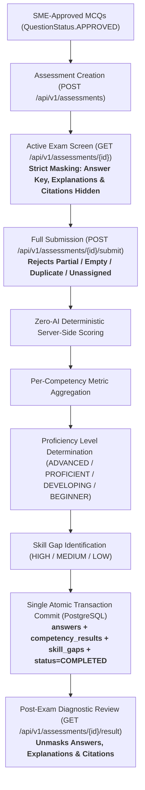

# StatKarmayogi — Phase 7 Walkthrough
## Officer Assessment, Deterministic Scoring & Competency Gap Analysis

**Smart India Hackathon 2026**
- **Problem Statement ID**: SIH26101
- **Organization**: Ministry of Statistics and Programme Implementation (MoSPI)
- **Theme**: Smart Education
- **Phase**: Phase 7 — Officer Assessment, Deterministic Scoring & Competency Gap Analysis
- **Status**: Completed, Fully Audited & Live-Verified

---

## 1. Executive Summary

Phase 7 moves **StatKarmayogi** from content ingestion, question generation, and SME validation into the actual competency assessment and diagnostic testing workflow:



---

## 2. Core Architectural Directives Enforced

1. **Zero Database Schema Modifications**:
   - Exactly **16 tables** remain in PostgreSQL.
   - Reused existing tables: `assessments`, `assessment_questions`, `answers`, `competency_results`, `skill_gaps`, `questions`, `competencies`, `users`, `documents`.
   - Reused existing PostgreSQL enums: `assessment_status_enum`, `proficiency_level_enum`, `gap_level_enum`.
   - **Zero Alembic migrations or DDL changes** were introduced.
2. **Direct Assessment Lifecycle (No Attempts Table)**:
   - All assessment operations execute directly on `/api/v1/assessments` per the relational architecture where each `assessments` record represents an officer's assessment instance (`officer_id` NOT NULL).
3. **Deterministic Question Selection**:
   - Questions are filtered exclusively from `QuestionStatus.APPROVED` with `competency_id IS NOT NULL` and sorted via `ORDER BY questions.id ASC`. Zero random selection.
4. **Strict Exam Security & Answer Masking**:
   - While `assessment.status == IN_PROGRESS`, the backend strictly masks `correct_option`, `is_correct`, `explanation`, `source_page`, and `source_chunk_id`.
   - The `/result` endpoint blocks calls with `HTTP 400 Bad Request` while an assessment is in progress.
5. **Full Submission Requirement**:
   - Submissions require answers for **every** assigned question. Partial submissions, empty submissions, duplicate question IDs, and unassigned questions return `HTTP 400 Bad Request`.
6. **Configurable Prototype Thresholds**:
   - Proficiency thresholds (`ADVANCED >= 80%`, `PROFICIENT >= 65%`, `DEVELOPING >= 50%`, `BEGINNER < 50%`) and gap thresholds (`HIGH < 50%`, `MEDIUM < 65%`, `LOW < 80%`) are defined in `app/core/config.py`.
   - **Disclaimer**: These are configurable prototype benchmarks and are **not** official MoSPI standards.
7. **Single Atomic Database Transaction & Rollback**:
   - Submissions atomically insert `answers`, `competency_results`, and `skill_gaps`, and update `assessments.status` to `COMPLETED` within a single database transaction. Failure at any point triggers `db.rollback()`.
8. **RBAC & Ownership Security**:
   - Officers can only view and submit their own assessments.
   - Trainers and Admins can inspect assessments and results across all officers.
   - Trainers and SMEs cannot create assessments (`HTTP 403 Forbidden`).
   - SMEs receive `HTTP 403 Forbidden` across all assessment endpoints.
   - Completed assessments cannot be resubmitted (`HTTP 400 Bad Request`).
9. **Zero Phase 8 Bleed**:
   - No course recommendations, learning pathways, or mock iGOT integrations were added.

---

## 3. End-to-End Component Walkthrough

### A. Configuration (`app/core/config.py`)
Configured default assessment volume limits and prototype scoring thresholds:
```python
# Assessment & Scoring Settings (Phase 7)
DEFAULT_ASSESSMENT_QUESTION_COUNT: int = 10
MAX_ASSESSMENT_QUESTION_COUNT: int = 50
ADVANCED_THRESHOLD: float = 80.0
PROFICIENT_THRESHOLD: float = 65.0
DEVELOPING_THRESHOLD: float = 50.0
```

### B. Schemas (`app/schemas/assessment.py`)
1. **`AssessmentCreateRequest`**:
   - Validates `title` (3-255 chars), `question_count` (1-50), optional `competency_id`, optional `document_id`, and optional `officer_id` (admin only).
2. **`AssessmentQuestionResponse`**:
   - Active exam schema. Safely exposes only `id`, `question_order`, `question_text`, options `A`/`B`/`C`/`D`, `difficulty`, and `competency_id`. Strictly omits correct answers and explanations.
3. **`AnswerSubmission` & `AssessmentSubmitRequest`**:
   - Validates each answer choice (`A`, `B`, `C`, or `D`) and accepts a batch of answers.
4. **`CompetencyResultResponse` & `SkillGapResponse`**:
   - Outputs per-competency attempted count, correct count, percentage, proficiency level, and detected skill gaps.
5. **`AssessmentQuestionDetailResponse`**:
   - Post-completion unmasked review exposing `selected_option`, `correct_option`, `is_correct`, educational `explanation`, `source_page`, and `source_chunk_id`.
6. **`AssessmentResultResponse`**:
   - Full evaluated report containing score, competency results, skill gaps, and question reviews.

### C. Service Business Logic (`app/services/assessment_service.py`)
1. **`calculate_proficiency_level(score_percentage)`**:
   - Deterministic evaluation:
     - $\ge 80.0\% \implies \text{ADVANCED}$
     - $\ge 65.0\% \implies \text{PROFICIENT}$
     - $\ge 50.0\% \implies \text{DEVELOPING}$
     - $< 50.0\% \implies \text{BEGINNER}$
2. **`calculate_gap_level(score_percentage)`**:
   - Deterministic gap severity:
     - $< 50.0\% \implies \text{HIGH}$
     - $< 65.0\% \implies \text{MEDIUM}$
     - $< 80.0\% \implies \text{LOW}$
     - $\ge 80.0\% \implies \text{None}$ (No gap)
3. **`create_assessment(db, request, current_user)`**:
   - Enforces RBAC (only `OFFICER` and `ADMIN` allowed).
   - Validates optional competency/document filters.
   - Deterministically queries:
     ```python
     query = db.query(Question).filter(
         Question.status == QuestionStatus.APPROVED,
         Question.competency_id.isnot(None),
     )
     selected_questions = query.order_by(Question.id.asc()).limit(request.question_count).all()
     ```
   - Persists `Assessment` (status: `IN_PROGRESS`) and `AssessmentQuestion` records.
4. **`get_assessment(db, assessment_id, current_user)`**:
   - Enforces officer ownership (Officer A cannot access Officer B's exam).
   - Returns questions formatted via `AssessmentQuestionResponse` with zero answer key leakage.
5. **`submit_assessment(db, assessment_id, request, current_user)`**:
   - Validates status is `IN_PROGRESS`.
   - Validates non-empty submission (rejects empty array with 400).
   - Validates all assigned questions answered (rejects partial with 400).
   - Validates no duplicate questions (rejects duplicate with 400).
   - Validates no unassigned questions (rejects unassigned with 400).
   - Evaluates correctness: `is_correct = (ans.selected_option.upper() == q.correct_option.upper())`.
   - Computes overall score and per-competency metrics.
   - Evaluates proficiency and persists `CompetencyResult`.
   - Identifies and persists `SkillGap`.
   - Sets `assessment.status = COMPLETED` and `completed_at = now()`.
   - Commits atomically in one single database transaction with automatic `db.rollback()` on error.
6. **`get_assessment_result(db, assessment_id, current_user)`**:
   - Blocks if status is `IN_PROGRESS` (400 Bad Request).
   - Returns unmasked question reviews, explanations, citations, competency breakdown, and skill gaps.
7. **`list_assessments(db, current_user, status_filter, skip, limit)`**:
   - Officers see only their own assessments; Trainers and Admins can view all; SMEs receive 403 Forbidden.

### D. API Router (`app/routers/assessments.py`)
Mounted under `/api/v1/assessments` with explicit `require_roles` dependencies:
- `POST /api/v1/assessments`: `require_roles(RoleName.OFFICER, RoleName.ADMIN)`
- `GET /api/v1/assessments`: `require_roles(RoleName.OFFICER, RoleName.TRAINER, RoleName.ADMIN)`
- `GET /api/v1/assessments/{id}`: `require_roles(RoleName.OFFICER, RoleName.TRAINER, RoleName.ADMIN)`
- `POST /api/v1/assessments/{id}/submit`: `require_roles(RoleName.OFFICER, RoleName.ADMIN)`
- `GET /api/v1/assessments/{id}/result`: `require_roles(RoleName.OFFICER, RoleName.TRAINER, RoleName.ADMIN)`

---

## 4. Automated Test Suite Walkthrough (`tests/test_assessments.py`)

All 28 required test cases pass cleanly with zero API credits consumed:

```powershell
python -m pytest -v
```

```text
============================= test session starts =============================
platform win32 -- Python 3.14.5, pytest-9.1.1, pluggy-1.6.0
rootdir: C:\SIH\backend
configfile: pytest.ini
testpaths: tests
plugins: anyio-4.13.0, langsmith-0.8.5
collected 125 items

tests\test_assessments.py ............................                   [ 22%]
tests\test_auth.py .............................                         [ 45%]
tests\test_documents.py ........................                         [ 64%]
tests\test_health.py .....                                               [ 68%]
tests\test_models.py ..........                                          [ 76%]
tests\test_questions.py .............................                    [100%]

======================= 125 passed, 2 warnings in 7.04s =======================
```

### Complete 28-Test Verification Matrix:
| # | Test Name | Target Behavior Verified |
| :-: | :--- | :--- |
| 1 | `test_unauthenticated_cannot_access_assessments` | Unauthenticated access to any assessment endpoint returns 401 |
| 2 | `test_officer_can_create_assessment` | Officer creates assessment starting `IN_PROGRESS` |
| 3 | `test_admin_can_create_assessment` | Admin creates assessment for self or designated officer |
| 4 | `test_trainer_cannot_create_assessment` | Trainer creation attempt returns 403 Forbidden |
| 5 | `test_sme_cannot_access_assessment_endpoints` | SME access returns 403 across all 5 assessment endpoints |
| 6 | `test_only_approved_questions_selected` | Excludes `PENDING_REVIEW`, `REJECTED`, and un-tagged MCQs |
| 7 | `test_competency_filter_works` | Filters questions strictly by requested `competency_id` |
| 8 | `test_document_filter_works` | Filters questions strictly by requested `document_id` |
| 9 | `test_deterministic_question_ordering` | Verifies deterministic ordering by `questions.id ASC` |
| 10 | `test_insufficient_approved_questions_rejected` | Requesting more MCQs than available returns 400 |
| 11 | `test_correct_answers_masked_during_in_progress` | Active exam hides `correct_option` and `is_correct` |
| 12 | `test_explanations_masked_during_in_progress` | Active exam hides educational `explanation` |
| 13 | `test_source_metadata_masked_during_in_progress` | Active exam hides `source_page` and `source_chunk_id` |
| 14 | `test_officer_cannot_access_another_officers_assessment` | Officer B access to Officer A exam returns 403 |
| 15 | `test_result_endpoint_blocked_before_completion` | Accessing `/result` while `IN_PROGRESS` returns 400 |
| 16 | `test_submission_rejects_missing_answers` | Partial answers submission returns 400 |
| 17 | `test_submission_rejects_empty_answers` | Empty answers array (`{"answers": []}`) returns 400 Bad Request |
| 18 | `test_submission_rejects_duplicate_answers` | Duplicate answers for same question return 400 |
| 19 | `test_submission_rejects_unassigned_question` | Foreign question ID in answers returns 400 |
| 20 | `test_invalid_selected_option_returns_422` | Invalid option (e.g., 'E') returns 422 validation error |
| 21 | `test_deterministic_scoring_competency_results_and_skill_gaps` | Server-side scoring (3/4=75%), competency results, gaps |
| 22 | `test_proficiency_and_gap_level_threshold_functions` | Threshold mapping: `ADVANCED`, `PROFICIENT`, `DEVELOPING`, `BEGINNER` |
| 23 | `test_competency_result_persistence` | Database inspection of `competency_results` table |
| 24 | `test_skill_gap_persistence` | Database inspection of `skill_gaps` table |
| 25 | `test_completed_result_unmasking` | Completed results unmask answers, explanations, citations |
| 26 | `test_repeated_submission_rejected` | Resubmitting completed assessment returns 400 |
| 27 | `test_submit_atomic_rollback` | Simulated failure triggers `db.rollback()` leaving 0 partial records and assessment `IN_PROGRESS` |
| 28 | `test_list_assessments_pagination_and_ownership` | Officer sees own; Trainer/Admin see all; pagination |

---

## 5. Live PostgreSQL Verification Walkthrough (`scratch/verify_phase_7_assessment.py`)

Executed directly against live PostgreSQL (`localhost:5432/statkarmayogi_db`):
- `[OK]` **Step 1**: Seeded roles and authenticated test personas (Officer 1, Officer 2, Trainer, SME, Admin).
- `[OK]` **Step 2**: Created competencies: 'ASI Survey Methodology' and 'Index of Industrial Production (IIP)'.
- `[OK]` **Step 3**: Created 4 APPROVED questions + 1 pending, 1 rejected, and 1 null-competency question.
- `[OK]` **Step 4**: Officer 1 created assessment (`id=212`, status `IN_PROGRESS`).
- `[OK]` **Step 5**: Deterministic question ordering verified (`ORDER BY questions.id ASC`).
- `[OK]` **Step 6**: Security verified — answer keys, explanations, and citations strictly masked (`None`).
- `[OK]` **Step 7**: Results endpoint blocked while `IN_PROGRESS` (400 Bad Request).
- `[OK]` **Step 8**: RBAC verified — Trainer and SME creation attempts rejected (403 Forbidden).
- `[OK]` **Step 9**: Empty submission correctly rejected (400 Bad Request).
- `[OK]` **Step 10**: Partial submission correctly rejected (400 Bad Request) — all questions must be answered.
- `[OK]` **Step 11**: Duplicate question submission correctly rejected (400 Bad Request).
- `[OK]` **Step 12**: Unassigned question submission correctly rejected (400 Bad Request).
- `[OK]` **Step 13**: Overall score calculated deterministically: 3/4 correct = 75.0%, status `COMPLETED`.
- `[OK]` **Step 14**: Competency ASI scored 100% $\implies$ Proficiency: `ADVANCED`.
- `[OK]` **Step 15**: Competency IIP scored 50% $\implies$ Proficiency: `DEVELOPING`.
- `[OK]` **Step 16**: Skill gap verified: Competency IIP identified as `GapLevel.MEDIUM` (50.0%).
- `[OK]` **Step 17**: Detailed question review unmasked with explanations and source pages.
- `[OK]` **Step 18**: Repeated submission of completed assessment correctly rejected (400 Bad Request).
- `[OK]` **Step 19**: Officer data isolation enforced (Officer 2 receives 403 on Officer 1's assessment).
- `[OK]` **Step 20**: Trainer and Admin can inspect completed assessment results.
- `[OK]` **Step 21**: Database records directly verified in PostgreSQL (`answers`, `competency_results`, `skill_gaps`).
- `[OK]` **Step 22**: ZERO schema changes confirmed — exactly 16 existing tables present.

---

## 6. Swagger & OpenAPI Verification

FastAPI OpenAPI specification verified at runtime:
- Paths exposed:
  - `POST /api/v1/assessments` (`OAuth2PasswordBearer` security)
  - `GET /api/v1/assessments` (`OAuth2PasswordBearer` security)
  - `GET /api/v1/assessments/{assessment_id}` (`OAuth2PasswordBearer` security)
  - `POST /api/v1/assessments/{assessment_id}/submit` (`OAuth2PasswordBearer` security)
  - `GET /api/v1/assessments/{assessment_id}/result` (`OAuth2PasswordBearer` security)
- Direct inspection: `GET /docs` and `GET /openapi.json` return `HTTP 200 OK`.

---

## 7. Explicit Phase Boundary

- **Phase 7 Implementation Is Complete**:
  - Content ingestion, SME review, assessment creation, answer masking, submission validation, deterministic scoring, proficiency tier assignment, and skill gap identification are 100% complete and verified.
- **Phase 8 (Ready for Implementation)**:
  - Phase 8 will match the `skill_gaps` records against public iGOT courses via a mock REST adapter to construct personalized learning pathways.
  - Zero Phase 8 code or course recommendations were introduced in Phase 7.
